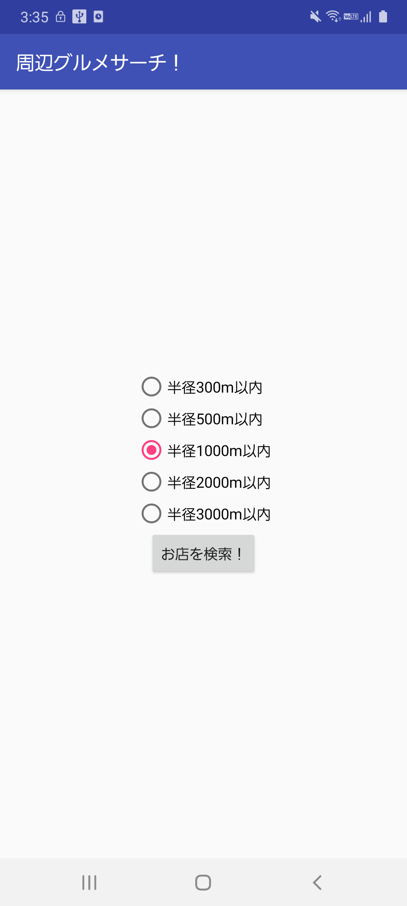
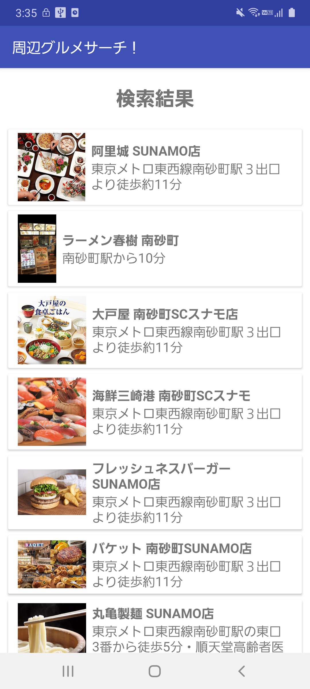
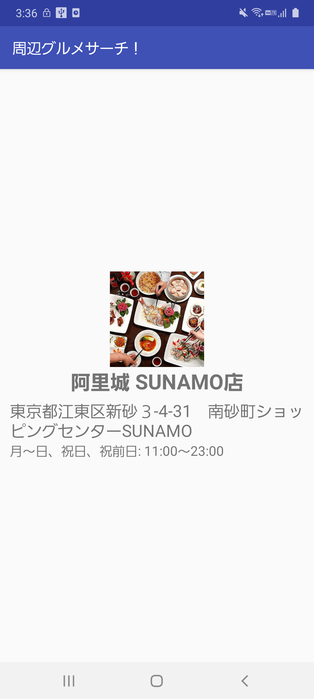

# 簡易仕様書

## 起動前にしなければならないこと
ホットペッパーグルメサーチ APIのAPIキーを事前に入力してください。

入力場所は、values/strings.xml 内の、
```
<string name="gourmet_api_key">apikeyを設定</string>
```
です。「apikeyを設定」の部分をapiキーに置き換えてください。

## アプリ名
周辺グルメサーチ！
## 対象OS
Android 6.0〜11
## 開発環境/言語
- Android Studio: Arctic Fox | 2020.3.1 
- Kotlin
## 開発期間
2週間
## 機能概要
- 現在地周辺のお店を検索する機能
  - ホットペッパーグルメサーチ API を使用
  - 現在地からの半径を指定可能
- お店の詳細表示機能
## 画面概要
### お店検索画面

ラジオボタンで検索半径を指定し、「お店を検索！」ボタンを押すとお店検索結果画面へ遷移します。

### お店検索結果画面

現在位置情報と検索半径のデータをパラメータとして、ホットペッパーグルメサーチ APIを使用しヒットしたお店を表示します。

表示情報として、店舗名称、アクセス、お店の画像を表示しています。

表示はRecyclerViewを用いて実装しています。

お店検索結果画面のお店をタップするとそのお店の詳細画面に遷移します。

### お店詳細画面


お店の詳細画面です。

表示情報は、店舗名称、住所、営業時間、お店の画像です。

## 今後実装すべき機能
今回は実装できなかったのですが、下記のような機能を実装すれば、よりユーザーにとって使いやすくなると思いました。

### お店検索画面
お店を決める重要な要因として予算があると思います。検索条件に半径の他に予算を加えることができれば、より有意義な検索が行えると思いました。

### お店詳細画面
- 「電話をかける！」ボタン
  - これを押すと端末の通話機能を使ってそのお店に電話がかかるようにします。このアプリ使用するユーザーは、特にお店の予約等をしていない方であると想像が付くため、調べたお店に空席があるかどうかを確認するために電話をかける機会が多いのではないかと考えました。
- 「ここにいく！」ボタン
  - これを押すとGoogle Mapに移動し、調べたお店にピン留めされている状態に遷移します。そのお店に行くことを決める場合、いちいちGoogle Mapを開いて経路を調べるのは手間であると考えられるためです。
- 予算や席数等、他にもお店に関する有益な情報を取得できるため、デザインを考えた上でそれらを表示すること
  
## 使用しているライブラリ、SDK など
- アーキテクチャ
  - MVVM
- ライブラリ
  - RecyclerView
  - Picasso
  - Data Binding 
  - ViewModel
  - LiveData
  - Coroutine
  - Retrofit2
  - Gson

## コンセプト
簡単操作でサクッと周辺のお店を検索できるアプリ

## こだわったポイント
- MVVMで設計し、各プログラムの責務の切り分けを明確にしました。
- databindingを用いて、viewとデータに関する記述量を減らしました。
- Coroutineを用いて、非同期処理を実装しました。
- お店検索結果が多かった場合にも処理が重くならないように、RecyclerViewで検索結果リストを実装しました。
- 検索半径未設定時や位置情報がOFFだった時など、検索時に必要な情報が足りていない場合には、その都度トーストメッセージでどんな状態かを示すことでユーザーが混乱するのを回避できるようにしました。

## デザイン面でこだわったポイント
- お店の情報を取得中の場合に、ただ取得を待っているだけだとユーザーがフリーズしたと勘違いしてしまうため、非同期処理の活用と「Loading ...」と表示することで情報取得完了までの間のユーザーの不安を解消しました
- お店検索結果画面にて、画像とお店の情報が綺麗に横並びになるように、LinearLayoutとGravityを活用しました。

## アドバイスして欲しいポイント
今回の課題では主にコードの設計、保守性向上の部分に特に注力しました。しかし、まだまだその点に関して不完全な部分があるのではないかと予想しています。
そのため、設計（MVVM）とコードの保守性に対して、何か考慮漏れがあったならばどのようにそれらを改善できるかをご教授いただきたいです。

## 自己評価
### 良かった点
「設計」と「保守性」を意識したアプリ開発を行えたことです。
今回はアーキテクチャパターンとしてMVVMを用いたのですが、Model, View, ViewModelそれぞれの責務を意識しながらプログラムの切り分けを行うことができました。
とはいえ、まだまだ不完全な部分もあると感じるので（Fat Fragmentになってしまっている箇所あり）、引き続き調査を続けたいです。

### 反省点
2週間の間、ほとんどの時間を設計と保守性の調査と実装にかけてしまったため、デザインの考慮と指定要件以外の機能実装を行うことができませんでした。
そのため、もっと使いやすいと思ってもらえるようなスッキリとしたデザインと、「今後実装すべき機能」で挙げた機能の実装を今後は進めていければと思っています。
